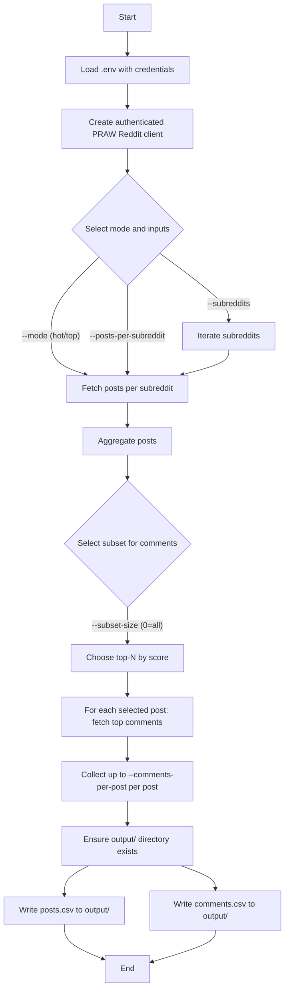
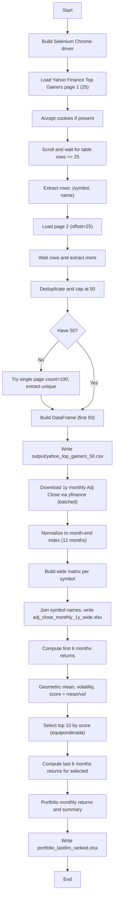

Reddit Data Collection (PRAW)

Overview
This project collects Reddit posts and top comments using PRAW and saves them to CSV files in the repository-level `output/` directory.

Setup
1) Create a Reddit app (type: script) at https://www.reddit.com/prefs/apps
   - Copy client_id and client_secret
   - Use your Reddit username and password
   - Set a descriptive user agent, e.g.: Python:PoliticalSentimentAnalyzer:v1.0 (by /u/<your_username>)

2) Create your .env
   - Create a `.env` file in the project root with the following keys:
     - REDDIT_CLIENT_ID
     - REDDIT_CLIENT_SECRET
     - REDDIT_USERNAME
     - REDDIT_PASSWORD
     - REDDIT_USER_AGENT

3) Install dependencies
   - python3 -m venv .venv
   - source .venv/bin/activate
   - pip install -r requirements.txt

Run the collector
By default it collects 20 posts per subreddit from r/politics, r/PoliticalDiscussion, r/worldnews, and fetches 5 top comments for the most relevant posts (by score).
Outputs are written to `output/posts.csv` and `output/comments.csv`.

Examples
   - python code/reddit_api.py --mode hot
   - python code/reddit_api.py --mode top --posts-per-subreddit 20 --comments-per-post 5

CLI options
   --subreddits                Space-separated list without r/ (default: politics PoliticalDiscussion worldnews)
   --mode                      hot | top (default: hot)
   --posts-per-subreddit       Number of posts per subreddit (default: 20)
   --comments-per-post         Number of comments per selected post (default: 5)
   --subset-size               Top-N posts (by score) to collect comments for; 0=all (default: 10)
   --output-dir                Directory for CSVs (default: output)

Notes
   - The script links each comment to its parent post via the post_id field.
   - Ensure your Reddit app is of type "script"; username/password are required for that app type.

Flow diagram

Yahoo Gainers Scraper (Selenium + yfinance)

Overview
This script scrapes Yahoo Finance Top Gainers (50 symbols), stores them in a CSV, downloads 1-year monthly Adj Close prices with yfinance, builds a wide matrix per symbol, and creates a simple ranked portfolio based on high geometric mean and low volatility in the first 6 months.

Setup
1) Requirements are in requirements.txt (already used for Reddit):
   - pandas, selenium, yfinance, numpy, openpyxl
   - Ensure Google Chrome is installed. Selenium 4.6+ auto-manages the driver.

2) Install dependencies
   - python3 -m venv .venv
   - source .venv/bin/activate
   - pip install -r requirements.txt

Run the scraper
   - python code/web_scraping_yahoo.py

Outputs
   - output/yahoo_top_gainers_50.csv
   - output/adj_close_monthly_1y_wide.xlsx
   - output/portfolio_last6m_ranked.xlsx

Notes
   - The script accepts cookie banners automatically when present.
   - To run headless, change build_driver(headless=False) to build_driver(headless=True) in code/web_scraping_yahoo.py.
   - Network reliability matters for both Selenium page loads and yfinance downloads; the script includes simple retries.

Flow diagram

